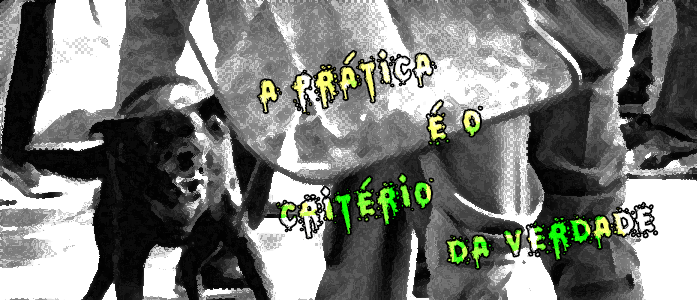

<h1 align="center" class="hello">
  
</h1>

<h5 align="center">
  <code><a href="https://www.linkedin.com/in/pedro-paulo-mirilli-742092b0/" title="LinkedIn Profile"> LinkedIn</a></code>
  <code><a href="https://github.com/xofen" title="HackerRank Profile"> GitHub</a></code>
</h5>
 

  Olá, sou Pedro Paulo Mirilli, FullStack e Artista Plástico do Brasil  Hi, I'm Pedro Paulo Mirilli, FullStack and Visual Artist from Brazil  Hola, soy Pedro Paulo Mirilli, FullStack y Artista Visual de Brasil 

 

<h3 align="center">Languages</h3> 

  
  
  
  
  
  
  

<h3 align="center">Other Stuff</h3>

  
  
  
  
  
  
  
  
  

(and a little more...)

<h3 align="center">Stats</h3>

  

    
  

   

<h3 align="center">Useful Links</h3>
 

<a href="https://xofen.github.io/portfolio/">My personal 'website' at GitHub Pages</a>  
<a href="https://mirilli-test-site.tech">A website for 'stuff-testing' with my brother</a>  
<a href="https://www.youtube.com/watch?v=LIWRydRgqyA">A 'peaceful' music</a>

 

